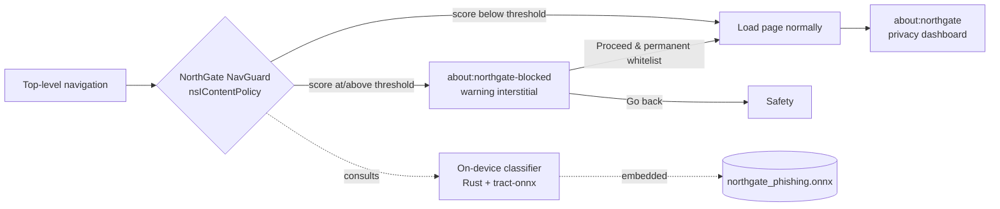

<div align="center">

# NorthGate Browser

**Un navegador centrado en la privacidad, con protección anti-phishing en el propio dispositivo.**

Construido sobre [Mullvad Browser](https://mullvad.net/browser) y Firefox, endurecido para la privacidad y ampliado con un clasificador de phishing totalmente local que nunca manda tu navegación a ninguna parte.

[](https://github.com/eduolihez/northgate-browser/actions/workflows/build.yml)
[](https://www.mozilla.org/MPL/2.0/)


### **[Versión en Español](README.md)** · [English version](README.en.md)

</div>

---

## Resumen

NorthGate es un fork orientado a seguridad que mantiene la postura de privacidad de Mullvad Browser (Firefox ESR más el endurecimiento de Tor Browser) y añade una capa pequeña de machine learning que marca los sitios que parecen phishing antes de que llegues a ellos. Toda la tubería de detección corre en tu dispositivo: el modelo va compilado dentro del binario y la puntuación no hace ninguna petición de red.

## Qué añade

Un modelo de ensemble de árboles exportado a ONNX puntúa cada navegación de nivel superior usando solo características léxicas de la URL. La inferencia corre en local a través de `tract-onnx`, en Rust puro, sin dependencias binarias externas y sin llamadas de red.

Cuando una página puntúa como de alto riesgo, el guardián de navegación la intercepta y muestra un intersticial de aviso en `about:northgate-blocked`. Desde ahí puedes volver atrás, continuar una vez, o marcar una casilla para confiar en el sitio de forma permanente, lo que lo añade a una lista blanca persistente. El umbral de clasificación no es fijo: escala con el deslizador de nivel de seguridad del navegador (`Standard`, `Safer` o `Safest`).

`about:northgate` es el panel de privacidad y seguridad. Muestra la puntuación de privacidad del sitio actual, los rastreadores bloqueados desglosados por categoría, el veredicto del clasificador con una tarjeta de explicación detallada, y el historial de alertas de la sesión.

De Mullvad y Tor Browser, NorthGate hereda el anti-fingerprinting, la navegación siempre privada, la telemetría a cero y la protección contra fugas de DNS. Ver [Privacidad y modelo de amenazas](#privacidad-y-modelo-de-amenazas) más abajo.

La parte de ML es reproducible: la recogida del dataset, la ingeniería de características, el entrenamiento y la exportación a ONNX están todos escritos en scripts y documentados en [`ml-model/`](ml-model/).

## Cómo funciona



El clasificador se entrena offline a partir de feeds públicos de phishing (PhishTank, OpenPhish) y sitios legítimos de cabecera (Tranco). Solo usa características que se pueden calcular desde una cadena de URL sin tocar la red: longitud de la URL, entropía, host que es una IP literal, profundidad de subdominios, HTTPS, palabras clave sospechosas y alguna más.

## Privacidad y modelo de amenazas

NorthGate hereda el endurecimiento de Mullvad y Tor Browser (Base Browser).

Resist Fingerprinting está activo y bloqueado en las builds de release, lo que significa user agent falseado, zona horaria UTC, tamaño de pantalla con letterboxing, una lista blanca de fuentes incluidas, y envenenamiento de la lectura de canvas y WebGL. WebGL2, WebGPU y el canvas fuera de pantalla están desactivados. La idea es mantener grande el conjunto de anonimato.

La navegación privada es permanente, con la caché en disco, el historial, las contraseñas guardadas y el historial de certificados desactivados, para minimizar los rastros forenses locales. La telemetría está desactivada y bloqueada, los identificadores de cliente y de perfil están fijados a valores canario, y Normandy/Shield/Nimbus, Safe Browsing y el reporte de fallos están todos apagados.

Para la protección contra fugas, DNS-over-HTTPS corre en modo TRR-only sin fallback en texto plano, y el bypass del proxy está bloqueado. NorthGate no incluye Tor y no oculta tu IP por sí mismo. Endurece el cliente y espera correr detrás de Mullvad VPN o de un túnel de confianza.

uBlock Origin y NoScript vienen con el navegador y no se pueden desinstalar. El deslizador de nivel de seguridad controla NoScript.

[`src/THREAT_MODEL.md`](src/THREAT_MODEL.md) tiene el inventario completo de controles, con qué mitiga cada uno y contra qué no protege explícitamente.

### Qué hace y qué no hace el modelo local

El modelo ONNX va embebido en el binario y el ONNX Runtime se enlaza sin ninguna descarga dinámica, así que la puntuación nunca sale de tu máquina.

El historial de alertas guarda solo nombres de host, nunca URLs completas, que pueden llevar tokens de sesión. No registra nada de las ventanas de navegación privada.

Si el clasificador no está disponible en algún momento, el guardián de navegación deja pasar la carga. Nunca puede bloquear ni romper la navegación normal.

## Estructura del repositorio

```
northgate-browser/
├── src/                     NorthGate browser source (Mullvad Browser / Firefox fork)
│   ├── browser/components/northgate-browser/   dashboard, nav guard, interstitial
│   └── toolkit/components/northgate/           Rust ONNX classifier (XPCOM service)
├── ml-model/                Phishing classifier: dataset pipeline, training, ONNX export
│   ├── dataset/             feed collection + feature extraction
│   └── model/               training script + exported northgate_phishing.onnx
├── docs/                    Wiki / Documentation articles
│   ├── ARCHITECTURE.md      Detailed components & security boundaries architecture
│   └── FAQ.md               Phishing protection & design FAQ
├── .github/workflows/       CI: build & release for Linux, Windows, macOS
└── README.md
```

## Compilar desde el código fuente

El navegador vive en [`src/`](src/), y todos los comandos de build se lanzan desde ahí.

```bash
cd src
./mach bootstrap --application-choice browser   # one-time: install toolchain
./mach build                                    # full build (can take 1-3 h)
./mach run                                       # launch NorthGate
```

Los cambios que solo tocan el front-end pueden usar `./mach build faster`. El componente ONNX en Rust necesita configuración adicional, documentada en [`src/toolkit/components/northgate/INTEGRATION.md`](src/toolkit/components/northgate/INTEGRATION.md).

## Integración continua y releases

El [workflow de build](.github/workflows/build.yml) compila NorthGate para Linux, Windows y macOS en cada push a `main` y a demanda. Publicar una etiqueta de versión sube las builds empaquetadas a Releases:

```bash
git tag v0.1.0
git push origin v0.1.0
```

> Una compilación completa del tamaño de Firefox consume muchos recursos y normalmente necesita un runner grande o autoalojado para terminar de forma fiable en CI. Mira las advertencias en el archivo del workflow.

## Hoja de ruta

Fase 1, rebranding: los recursos, rutas, ajustes, locales e identificadores de Mullvad Browser pasados a NorthGate. *Hecho.*

Fase 2, seguridad con IA en local: tubería del dataset de phishing, clasificador ONNX, panel `about:northgate` y guardián de navegación. *En curso; la integración del modelo está pendiente de una compilación completa.*

Fase 3, herramientas de blue team: análisis local de scripts, diagnóstico de red y alertas más ricas.

## Créditos y licencia

NorthGate se apoya en el trabajo de [Mozilla Firefox](https://www.mozilla.org/firefox/), el [Proyecto Tor](https://www.torproject.org/) y [Mullvad](https://mullvad.net/). Se distribuye bajo la Mozilla Public License 2.0, ver [`LICENSE`](LICENSE) y [`src/NOTICE`](src/NOTICE). Las licencias y atribuciones de upstream se mantienen por todo `src/`.

Este proyecto no está afiliado a Mozilla, el Proyecto Tor ni Mullvad, ni respaldado por ellos.
