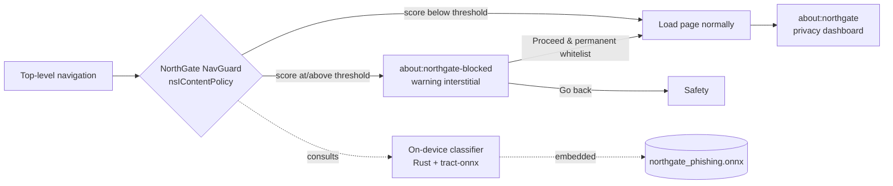

<div align="center">

# NorthGate Browser

**A privacy-first web browser with on-device phishing protection.**

Built on [Mullvad Browser](https://mullvad.net/browser) and Firefox, hardened for privacy, and extended with a fully local phishing classifier that never sends your browsing anywhere.

[](https://github.com/eduolihez/northgate-browser/actions/workflows/build.yml)
[](https://www.mozilla.org/MPL/2.0/)


</div>

---

## Overview

NorthGate is a security-focused fork that keeps the privacy posture of Mullvad Browser (Firefox ESR plus Tor Browser hardening) and adds a small machine-learning layer that flags likely phishing sites before you land on them. The whole detection pipeline runs on your device: the model is compiled into the binary, and scoring makes no network requests.

## What it adds

A tree-ensemble model exported to ONNX scores every top-level navigation using lexical URL features alone. Inference runs locally through `tract-onnx` in pure Rust, with no external binary dependencies and no network calls.

When a page scores as high risk, the navigation guard intercepts it and shows a warning interstitial at `about:northgate-blocked`. From there you can go back, proceed once, or tick a checkbox to trust the site permanently, which adds it to a persistent whitelist. The classification threshold is not fixed: it scales with the browser's Security Level slider (`Standard`, `Safer` or `Safest`).

`about:northgate` is the privacy and security dashboard. It shows the current site's privacy score, the trackers blocked broken down by category, the classifier's verdict with a detailed explanation card, and the alert history for the session.

From Mullvad and Tor Browser, NorthGate inherits anti-fingerprinting, always-private browsing, zero telemetry and DNS leak protection. See [Privacy & threat model](#privacy--threat-model) below.

The ML side is reproducible: dataset collection, feature engineering, training and ONNX export are all scripted and documented under [`ml-model/`](ml-model/).

## How it works



The classifier is trained offline from public phishing feeds (PhishTank, OpenPhish) and legitimate top sites (Tranco). It only uses features you can compute from a URL string without touching the network: URL length, entropy, IP-literal host, subdomain depth, HTTPS, suspicious keywords, and more.

## Privacy & threat model

NorthGate inherits the hardening of Mullvad/Tor Browser (Base Browser).

Resist Fingerprinting is on and locked in release builds, which means a spoofed user agent, UTC timezone, letterboxed screen size, a bundled-font whitelist, and poisoned canvas/WebGL readback. WebGL2, WebGPU and offscreen canvas are disabled. The point is to keep the anonymity set large.

Private browsing is permanent, with disk cache, history, saved passwords and cert history disabled to minimize local forensic traces. Telemetry is disabled and locked, client and profile IDs are pinned to canary values, and Normandy/Shield/Nimbus, Safe Browsing and crash reporting are all off.

For leak protection, DNS-over-HTTPS runs in TRR-only mode with no plaintext fallback, and proxy bypass is locked off. NorthGate does not ship Tor and does not hide your IP on its own. It hardens the client and expects to run behind Mullvad VPN or a trusted tunnel.

uBlock Origin and NoScript ship with the browser and cannot be uninstalled. The Security Level slider drives NoScript.

[`src/THREAT_MODEL.md`](src/THREAT_MODEL.md) has the full inventory of controls, including what each one mitigates and what it explicitly does not protect against.

### What the on-device model does and does not do

The ONNX model is embedded in the binary and the ONNX Runtime is linked without any dynamic download, so scoring never leaves your machine.

The alert history stores hostnames only, never full URLs, which can carry session tokens. It records nothing from private-browsing windows.

If the classifier is ever unavailable, the navigation guard lets the load through. It can never block or break normal browsing.

## Repository layout

```
northgate-browser/
├── src/                     NorthGate browser source (Mullvad Browser / Firefox fork)
│   ├── browser/components/northgate-browser/   dashboard, nav guard, interstitial
│   └── toolkit/components/northgate/           Rust ONNX classifier (XPCOM service)
├── ml-model/                Phishing classifier: dataset pipeline, training, ONNX export
│   ├── dataset/             feed collection + feature extraction
│   └── model/               training script + exported northgate_phishing.onnx
├── docs/                    Wiki / Documentation articles
│   ├── ARCHITECTURE.md      Detailed components & security boundaries architecture
│   └── FAQ.md               Phishing protection & design FAQ
├── .github/workflows/       CI: build & release for Linux, Windows, macOS
└── README.md
```

## Building from source

The browser lives in [`src/`](src/); all build commands run from there.

```bash
cd src
./mach bootstrap --application-choice browser   # one-time: install toolchain
./mach build                                    # full build (can take 1-3 h)
./mach run                                       # launch NorthGate
```

Front-end-only changes can use `./mach build faster`. The Rust ONNX component needs extra setup, documented in [`src/toolkit/components/northgate/INTEGRATION.md`](src/toolkit/components/northgate/INTEGRATION.md).

## Continuous integration & releases

The [build workflow](.github/workflows/build.yml) builds NorthGate for Linux, Windows and macOS on every push to `main` and on demand. Pushing a version tag publishes packaged builds to Releases:

```bash
git tag v0.1.0
git push origin v0.1.0
```

> A full Firefox-class build is resource-heavy and typically needs a large or self-hosted runner to complete reliably on CI. See the caveats in the workflow file.

## Roadmap

Phase 1, rebranding: Mullvad Browser assets, paths, settings, locales and identifiers rebranded to NorthGate. *Done.*

Phase 2, on-device AI security: phishing dataset pipeline, ONNX classifier, `about:northgate` dashboard and navigation guard. *In progress; model integration is pending a full build.*

Phase 3, blue-team tooling: local script analysis, network diagnostics and richer alerting.

## Credits & license

NorthGate builds on the work of [Mozilla Firefox](https://www.mozilla.org/firefox/), the [Tor Project](https://www.torproject.org/), and [Mullvad](https://mullvad.net/). It is distributed under the Mozilla Public License 2.0, see [`LICENSE`](LICENSE) and [`src/NOTICE`](src/NOTICE). Upstream licenses and attribution are retained throughout `src/`.

This project is not affiliated with or endorsed by Mozilla, the Tor Project, or Mullvad.
