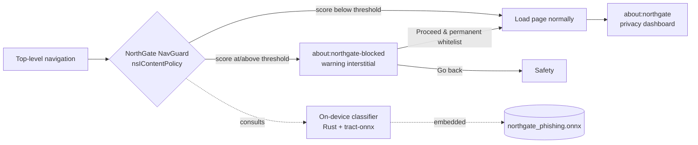

<div align="center">

# NorthGate Browser

**A privacy-first web browser with on-device, AI-powered phishing protection.**

Built on [Mullvad Browser](https://mullvad.net/browser) and Firefox, hardened for privacy, and extended with a fully local phishing classifier that never sends your browsing anywhere.

[](https://github.com/eduolihez/northgate-browser/actions/workflows/build.yml)
[](https://www.mozilla.org/MPL/2.0/)


</div>

---

## Overview

NorthGate is a security-focused fork that keeps the privacy posture of Mullvad Browser (Firefox ESR + Tor Browser hardening) and adds a small, transparent machine-learning layer that flags likely phishing sites **before** you land on them. Every part of the detection pipeline runs on your device: the model is compiled into the binary, and scoring makes **zero network requests**.

## Highlights

- **On-device phishing detection.** A tree-ensemble model exported to ONNX scores each top-level navigation from lexical URL features alone. Inference runs locally using `tract-onnx` in pure Rust with **zero external binary dependencies** and zero network requests.
- **Navigation guard with a friendly escape hatch.** High-risk pages are intercepted and replaced with a clear warning interstitial (`about:northgate-blocked`) that lets you go back, proceed temporarily, or **permanently trust the website** via a persistent whitelist checkbox.
- **Dynamic Sensitivity Slider.** The active classification threshold scales dynamically with the browser's Security Level Slider settings (`Standard`, `Safer`, or `Safest`).
- **Privacy & security dashboard.** `about:northgate` shows the current site's privacy score, trackers blocked (by category), the classifier's verdict with a structured, detailed explanation card, and a per-session alert history.
- **Inherited hardening.** Anti-fingerprinting, always-private browsing, zero telemetry, and DNS leak protection from Mullvad/Tor Browser (see [Privacy & threat model](#privacy--threat-model)).
- **Reproducible ML pipeline.** Dataset collection, feature engineering, training, and ONNX export are all scripted and documented under [`ml-model/`](ml-model/).

## How it works



The classifier is trained offline from public phishing feeds (PhishTank, OpenPhish) and legitimate top sites (Tranco), using only features that can be computed from a URL string with no network access — URL length, entropy, IP-literal host, subdomain depth, HTTPS, suspicious keywords, and more.

## Privacy & threat model

NorthGate inherits the hardening of Mullvad/Tor Browser (Base Browser):

- **Anti-fingerprinting.** Resist Fingerprinting (RFP) is on and locked in release builds — spoofed user agent, UTC timezone, letterboxed screen size, bundled-font whitelist, and canvas/WebGL readback poisoning. WebGL2, WebGPU, and offscreen canvas are disabled. The goal is a large shared anonymity set.
- **Always private browsing.** Permanent PBM with disk cache, history, saved passwords, and cert history disabled to minimize local forensic traces.
- **Zero telemetry.** Telemetry disabled and locked, client/profile IDs pinned to canary values; Normandy/Shield/Nimbus, Safe Browsing, and crash reporting are off.
- **Leak protection.** DNS-over-HTTPS in TRR-only mode with no plaintext fallback; proxy-bypass locked off. NorthGate does **not** ship Tor and does not hide your IP by itself — it hardens the client and expects to run behind Mullvad VPN or a trusted tunnel.
- **Bundled, non-removable extensions.** uBlock Origin and NoScript are shipped and cannot be uninstalled; NoScript is driven by the Security Level slider.

The full inventory of controls — what each mitigates and what it explicitly does **not** protect against — is in [`src/THREAT_MODEL.md`](src/THREAT_MODEL.md).

### On-device ML privacy commitments

- **No network calls from the phishing classifier.** The ONNX model is embedded in the binary; the ONNX Runtime is linked without any dynamic download, and scoring is entirely local.
- **One narrow, opt-in exception: the local LLM explanation feature.** `about:northgate`'s "Explain with local AI" button downloads a quantized language model (~1GB, from this project's own GitHub Releases, checksum-verified) the first time it's used, after explicit consent. This is the only network request anywhere in NorthGate's ML stack. After that one-time download, generation is 100% local, same as the classifier. The rest of NorthGate — including the phishing classifier and navigation guard — is completely unaffected if you never use this feature. The feature is currently disabled by default (`browser.northgate.llmExplain.enabled = false`) until on-device generation is finished.
- **No sensitive data retained.** The alert history stores hostnames only — never full URLs (which can carry session tokens) — and records nothing from private-browsing windows.
- **Fails safe.** If the classifier is ever unavailable, the navigation guard allows the load: it can never block or break normal browsing.

## Repository layout

```
northgate-browser/
├── src/                     NorthGate browser source (Mullvad Browser / Firefox fork)
│   ├── browser/components/northgate-browser/   dashboard, nav guard, interstitial
│   └── toolkit/components/northgate/           Rust ONNX classifier (XPCOM service)
├── ml-model/                Phishing classifier: dataset pipeline, training, ONNX export
│   ├── dataset/             feed collection + feature extraction
│   └── model/               training script + exported northgate_phishing.onnx
├── docs/                    Wiki / Documentation articles
│   ├── ARCHITECTURE.md      Detailed components & security boundaries architecture
│   └── FAQ.md               Phishing protection & design FAQ
├── .github/workflows/       CI: build & release for Linux, Windows, macOS
└── README.md
```

## Building from source

The browser lives in [`src/`](src/); all build commands run from there.

```bash
cd src
./mach bootstrap --application-choice browser   # one-time: install toolchain
./mach build                                    # full build (can take 1-3 h)
./mach run                                       # launch NorthGate
```

Front-end-only changes can use `./mach build faster`. The Rust ONNX component has additional setup — see [`src/toolkit/components/northgate/INTEGRATION.md`](src/toolkit/components/northgate/INTEGRATION.md).

## Continuous integration & releases

The [build workflow](.github/workflows/build.yml) builds NorthGate for **Linux, Windows, and macOS** on every push to `main` and on demand. Pushing a version tag publishes packaged builds to **Releases**:

```bash
git tag v0.1.0
git push origin v0.1.0
```

> A full Firefox-class build is resource-heavy and typically needs a large or self-hosted runner to complete reliably on CI. See the caveats in the workflow file.

## Roadmap

- **Phase 1 — Rebranding.** Mullvad Browser assets, paths, settings, locales, and identifiers rebranded to NorthGate. _Done._
- **Phase 2 — On-device AI security.** Phishing dataset pipeline, ONNX classifier, `about:northgate` dashboard, and navigation guard. _In progress (model integration pending a full build)._
- **Phase 3 — Blue-team tooling.** Local script analysis, network diagnostics, and richer alerting.

## Credits & license

NorthGate builds on the work of [Mozilla Firefox](https://www.mozilla.org/firefox/), the [Tor Project](https://www.torproject.org/), and [Mullvad](https://mullvad.net/). It is distributed under the **Mozilla Public License 2.0** — see [`LICENSE`](LICENSE) and [`src/NOTICE`](src/NOTICE). Upstream licenses and attribution are retained throughout `src/`.

This project is not affiliated with or endorsed by Mozilla, the Tor Project, or Mullvad.
