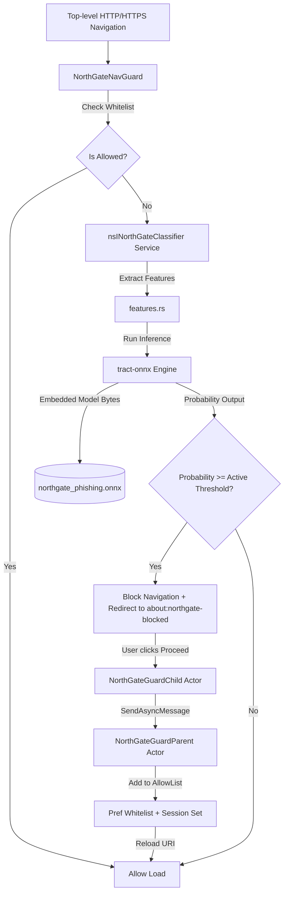

# NorthGate Browser Architecture

This document describes the high-level architecture of the NorthGate on-device phishing protection and privacy tracking system.

---

## 1. Components

The phishing protection suite consists of four distinct layers:

### 1.1 Content Policy Navigation Interceptor (`NorthGateNavGuard`)
* **Type**: `nsIContentPolicy` (Javascript ES Module service)
* **Location**: `src/browser/components/northgate-browser/NorthGateNavGuard.sys.mjs`
* **Role**: Gates all top-level HTTP/HTTPS document loads. If the destination URL is not allow-listed and the classifier assigns a score above the threshold, it rejects the request (`REJECT_REQUEST`) and schedules a redirect to the warning interstitial.
* **Sensitivity Scaling**: Dynamically scales the classification threshold based on the browser's Security Level Slider (`browser.security_level.security_slider`).

### 1.2 Pure-Rust ONNX Classifier (`nsINorthGateClassifier`)
* **Type**: Rust XPCOM Service
* **Location**: `src/toolkit/components/northgate/`
* **Engine**: `tract-onnx` (pure-Rust execution graph builder)
* **Role**: Runs local offline inference. It receives the normalized URL string, extracts 18 lexical features (e.g. Shannon entropy, suspicious keywords count, domain length, TLD indicators) in Rust via `features.rs`, and passes them into the embedded Random Forest ONNX model (`northgate_phishing.onnx`). It returns the phishing probability back to the JS navigation guard.

### 1.3 Privilege-Isolated Proceed Handler (`NorthGateGuardParent` & `Child`)
* **Type**: `JSWindowActor` Parent/Child pair
* **Location**: `src/browser/components/northgate-browser/NorthGateGuard{Parent,Child}.sys.mjs`
* **Role**: Bridges actions taken in the warning page (running in content process) to the parent process.
* **Security Bounds**: When proceeding, it avoids using elevated system principals (`SystemPrincipal`) for loading the target page, using a secure Null Principal mapped to the context's origin attributes.

### 1.4 Privacy Dashboard (`about:northgate`)
* **Type**: Privileged local UI page
* **Location**: `src/browser/components/northgate-browser/content/aboutNorthGate.html`
* **Role**: Collects tracker logs from the active tab and scores from the classifier, presenting a summarized privacy grade (A-F), active blockers breakdown, and real-time security alerts.

---

## 2. Security Bounds & Guarantees

* **Zero-Leak Guarantee**: Feature extraction is strictly lexical, performed in-memory on the URL string. No DNS queries, WHOIS lookups, or network pings are ever made by the classifier.
* **Strict Process Boundary Isolation**: Bypassing a blocked domain is handled by a restricted Null Principal. Target pages never run with elevated privileges or chrome permissions.
* **Dynamic Threshold Adaptability**: The classifier adjusts its threat limits based on the user's active privacy profile, making phishing blocks more aggressive in "Safer" and "Safest" modes.
